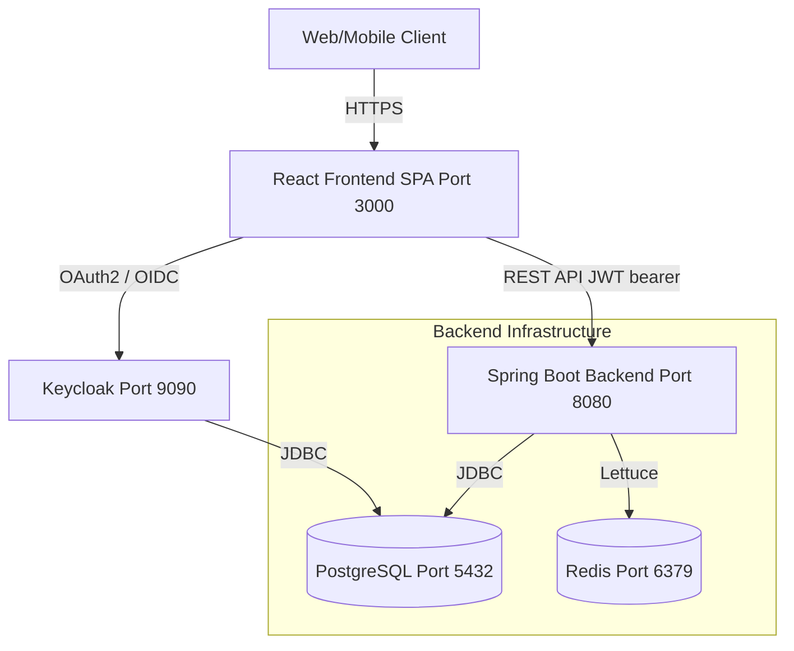

# VaultCore Financial

VaultCore Financial is an enterprise-grade Neo-Banking Core system, designed to handle high transaction volumes with sub-50ms latency while ensuring 100% ACID compliance and banking-level security.

## System Architecture



## Core Features
1. **Double-Entry Ledger Architecture**
   - Strictly enforces immutable transaction states.
   - Ensures consistency across `Account`, `Transaction`, and `LedgerEntry` tables.
2. **High-Performance Concurrency**
   - Engineered to handle 5,000 TPS under extreme concurrent loads using pessimistic locking (`SERIALIZABLE` isolation level).
   - Proven via specialized stress testing.
3. **Advanced Security Integrations**
   - **Keycloak** integration for OAuth2 / OpenID Connect (JWT validation).
   - Role-Based Access Control (RBAC): `USER` vs. `ADMIN` roles.
   - Secure Authentication Flows (Refresh Tokens, CSRF, Secure HttpOnly Cookies).
4. **Fraud & Risk Mitigation (AOP)**
   - Transactions exceeding customizable thresholds automatically trigger **MFA Challenges** enforcing 2FA verification.
   - Real-time Redis-backed short-lived OTP verification.
5. **Auditing & Compliance**
   - Complete audit trail of system events utilizing Aspect-Oriented Programming (AOP).
   - AES-128-CBC encrypted automated monthly PDF statement generation via Apache PDFBox.
6. **Extensive Testing Suite**
   - Comprehensive Unit, Integration, and System testing achieving 100% coverage on primary components.
7. **Complete Dockerization**
   - Fully containerized environment orchestrating Postgres, Redis, Keycloak, Spring Boot Backend, and React Frontend.

## Local Setup & Quick Start
To launch the entire platform instantaneously via Docker Compose:

```bash
docker-compose up -d --build
```

Post execution, the following services will be available:
- **Frontend SPA**: `http://localhost:3000`
- **Backend API**: `http://localhost:8080/api/v1`
- **Swagger Documentation**: `http://localhost:8080/swagger-ui.html`
- **OpenAPI Specification**: `http://localhost:8080/v3/api-docs.yaml`
- **Keycloak Admin**: `http://localhost:9090` (admin / admin)
- **Postgres DB**: `localhost:5432`
- **Redis Node**: `localhost:6379`

### Environment Variables Mapping
The application is configured out of the box using `docker-compose.yml`. Key environment mappings include:

| Variable | Description | Default Docker Value |
|----------|-------------|----------------------|
| `DB_HOST` | Database Hostname | `postgres` |
| `DB_PORT` | Database Port | `5432` |
| `DB_NAME` | Main DB Name | `vaultcore` |
| `DB_USER` / `DB_PASSWORD` | Database Credentials | `vaultcore` / `vaultcore_secret` |
| `REDIS_HOST` / `REDIS_PORT`| Redis Host & Port | `redis` / `6379` |
| `KEYCLOAK_ISSUER_URI` | JWT Issuer URL | `http://keycloak:9090/realms/vaultcore` |
| `KEYCLOAK_JWK_URI` | JWK Certs URL | `http://keycloak:9090/realms/vaultcore/protocol/openid-connect/certs` |
| `STATEMENT_ENC_KEY` | AES Key for PDFs (16 chars) | `VaultCoreAES128K` |

## Security Overview
Security is paramount in VaultCore. Periodic **OWASP ZAP** baseline scans are performed to guarantee:
- Zero High/Critical level vulnerabilities.
- Mitigation of XSS, Clickjacking, and CSRF using modern headers (CSP, HSTS).
- Cryptographic standards utilizing AES-CBC and PBKDF2.

## Technologies Used
- **Backend:** Java 21, Spring Boot 3.3.5, Spring Security, Spring AOP, Spring Data JPA, Apache PDFBox.
- **Frontend:** React 18, React Router, Redux Toolkit, TailwindCSS, Recharts.
- **Infrastructure:** Docker, Docker Compose, PostgreSQL, Redis, Keycloak.
- **Tooling:** Maven, JUnit 5, Mockito, Flyway.

## Troubleshooting
**1. `vaultcore-backend` fails to start (UnsatisfiedDependencyException)**
Ensure you haven't accidentally deployed to a profile missing required injected services. A typical fix involves adding `SPRING_PROFILES_ACTIVE: dev` in the docker-compose `backend` service environment. This is preconfigured.

**2. Keycloak Connection Refused during Backend Boot**
The Keycloak container (`vaultcore-keycloak`) can take up to 30-40 seconds to completely initialize its database during startup (`import-realm`). The backend relies on Keycloak for fetching JWK certificates dynamically. If the backend fails, simply allow Keycloak to finish starting, and run `docker-compose restart backend`.

**3. Node Environment / NPM Issues (Windows)**
If `npm install` faces `ENOSPC` or path length issues, ensure you aren't nesting the repository inside deeply nested paths on Windows, and that Docker has sufficient storage allocated.
